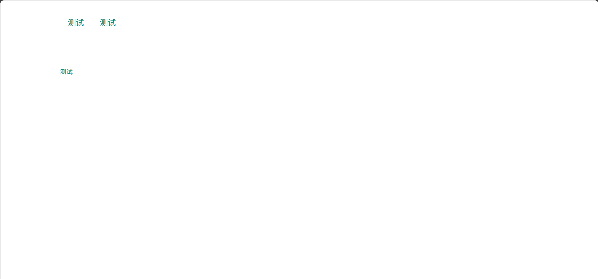
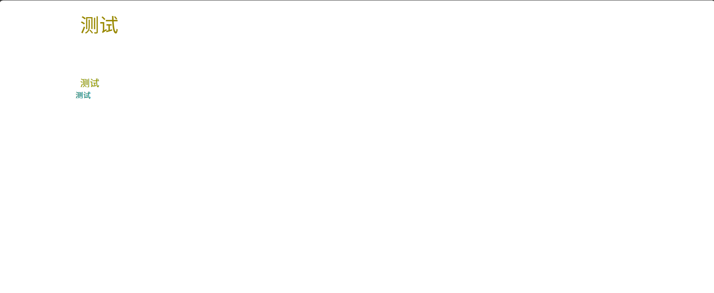

## 前言
当我们定义完网页元素，如以下内容：
``` HTML
<body>
    <div class="cs">
        <div class="cs-card">
            <p> 测试 </p>
            <p> 测试 </p>
        </div>
        <div class="cs-1">
            <p> 测试 </p>
        </div>
    <div>
</body>
```

在浏览器中会出现以下内容:
``` HTML
测试

测试

测试
```
这种的话就是缺少样式表内容

那要怎么样让网页美观，就需要有CSS文件了（全称：层叠样式表）

## 样式表不同引入方式以及功能区别

### 内置样式
第一种：在页面添加内置样式，例如：
``` HTML
<body>
    <style>
        body {
            max-width: 1200px;
            width: 100%;
            margin: 0 auto;
        }
        .cs {
            color: #098777;
        }
        .cs-card {
            max-height: 300px;
            height: 150px;
        }
        .cs-card p {
            font-size: 20px;
            padding: 20px 20px;
        }
    </style>
    <div class="cs">
        <div class="cs-card">
            <p> 测试 </p>
            <p> 测试 </p>
        </div>
        <div class="cs-1">
            <p> 测试 </p>
        </div>
    <div>
</body>
```
效果如下：


第二种：在网页元素中添加样式，例如
``` HTML
<body>
    <style>
        body {
            max-width: 1200px;
            width: 100%;
            margin: 0 auto;
        }
        .cs {
            color: #098777;
        }
        .cs-card {
            max-height: 300px;
            height: 150px;
        }
        .cs-card p {
            font-size: 20px;
            padding: 20px 20px;
            color: #909900;
        }
        .cs-1 {
            padding: 20px 30px
        }
    </style>
    <div class="cs">
        <div class="cs-card" style="max-height: 200px;">
            <p style="font-size: 40px;color:#988800"> 测试 </p>
            <p> 测试 </p>
        </div>
        <div class="cs-1" style="padding:20px 10px">
            <p> 测试 </p>
        </div>
    <div>
</body>
```
效果如下：


内置样式两种方式在不同级别中：一个是共同使用的样式，另外一个是单独一个元素中独立使用。区别就在于：第二种在网页中的优先渲染级高于第一种。

方法    |  功能                  |  优先级             |
--------|-----------------------|---------------------|
    1   | 在网页内嵌样式         |  等于外链样式表引用  |
    2   | 在网页元素中内嵌样式   |  高于任何引入样式方法 |

### 外置样式
分为多段式引入和引入外链
第一种：多段式引入样式表
功能：将多个css文件内联到一个css文件中
优点：多个css文件可以分为不同的功能进行内联，降低维护难、文件名称命名、可使用注释来进行分类。
缺点：需加载内联需要的css文件，导致请求缓慢，特别是在内联外部css时，如若请求失败会出现部分样式异常。
写法：
``` CSS
@import '你自己的css文件地址'
```

第二种：引入外链

功能：将网页中说需要的样式表进行分离到一个文件
优点：可以减少内嵌样式导致的页面负载过大
缺点：时间太久会导致命名混乱无章，可通过在css第一行添加注释来确定当前样式表功能功能
在网页中引用：
``` HTML
<link rel="stylesheet" href="你自己的css文件位置" media="print" onload='this.media="all"'>
```

## 基础写法

### 网页整体位置、宽高、偏移
``` CSS
body {
    max-width: 1200px;
    max-height: auto;
    min-width: 1000px;
    min-height: auto;
    width: 100%;
    height: 100%;
    margin: 0 auto;
    margin-left: 10px;
    margin-right: 10px;
    margin-top: 10px;
    margin-bottom: 10px;
    padding: 20px 20px 20px;
}
```
宽度高度类：
**width**：当前元素宽度为多少，在未定义**max-width**和**min-width**时，会通过此方式调整页面宽度
**height**：当前元素高度为多少，在为=未定义**max-height**和**min-height**时，会通过此方式调整页面高度
**max-width**：当前元素最大宽度为多少，最少不能低于1px。
**max-height**：当前元素最大高度为多少，最少不能低于1px.
**min-width**：与max-width相反，为当前元素最小宽度为多少，最少不能低于1px。
**min-height**：与**max-height**相反，为当前元素最小宽度为多少，最少不能低于1px。

位置类：
**margin**：调整位置，例如：**margin: 0 auto** 为 高度不变，宽度自动（随设备显示宽度进行变化），需要配合**max-width**选项进行使用。
**margin-top**：设置元素上外边距
**margin-bottom**：设置元素下外边距
**margin-left**：设置元素左外边距
**margin-right**：设置元素右外边距
**top**：设置元素上边距，需要有**position**类型才能使用。
**bottom**：设置元素下边距，需要有**position**类型才能使用。
**left**：设置元素左边距，需要有**position**类型才能使用。
**right**：设置元素右边距，需要有**position**类型才能使用。

偏移类：
**padding**：给网页元素添加一个内边距，具体参数为：上边距、宽度边距、下边距，如果单写一个参数就是默认了三个参数为一致，除非其他两个参数写为0，或者只有一个参数为0.

### 网页的元素的class和id
理论上来说任何元素中都可以添加class和id选择器来实现多个CSS不混用
1. id
HTML元素以id属性来设置id选择器,CSS 中 id 选择器以 "#" 来定义。
例如在HTML中写了一个实例：
``` HTML
<div id="class-panel"></div>
```
那么在CSS中要这样子：
``` CSS
#class-panel {
    /* 里面就是你要写到的样式内容 */
}
```
2. class
HTML元素以class属性来设置class选择器,CSS 中 id 选择器以 "." 来定义。
例如在HTML中写了一个实例：
``` HTML
<div class="class-panel"></div>
```
那么在CSS中要这样子：
``` CSS
.class-panel {
    /* 里面就是你要写到的样式内容 */
}
```

### 网页元素背景以及元素颜色

在网页中，如果想要在网页中的其中一个出现背景或者颜色，可以使用以下元素来使用：
backgroud：可以通过rgba、颜色数字代码、颜色英文来进行搭配
color：字体颜色